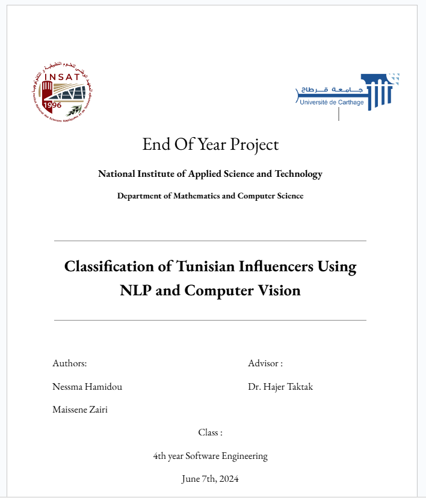

# Influencers Classification Project

## Table of Contents
- [Introduction](#introduction)
- [Project Description](#project-description)
- [Features](#features)
- [Dataset](#dataset)
- [Installation](#installation)

## Introduction
This project aims to classify social media influencers into different categories based on various their posts. The goal is to provide a tool for identifying key influencers in specific areas for marketing and collaboration purposes.
It's part of our end of year project at INSAT.

## Project Description
Influencer marketing has become a critical strategy for brands to reach their target audiences. However, finding the right influencers who align with a brand’s values and target demographics can be challenging. This project leverages machine learning techniques to classify influencers into distinct categories to aid marketers in their decision-making process. 

The project involves several steps:
1. **[Data Collection](./data-collection)**: Gathering data from Instagram using APIs and web scraping techniques such as Selenium.
2. **[Data Processing and analysis](./data-processing)**:
   1. **Data Preprocessing**: Cleaning and normalizing the data to ensure consistency and accuracy.
   2. **Data Exploration**: Conducting statistical analyses on the dataset to uncover insights such as the distribution of post languages, top categories of content, and other relevant statistics.
3. **[Modeling and Evaluation](./models)**
   1. **Model Training**: Using NLP and Computer Vision algorithms to train models on the extracted features.
   2. **Model Fusion**: Combining the outputs of two different models to improve classification accuracy.
   3. **Model Evaluation**: Evaluating the performance of the models using metrics such as accuracy, precision, recall, and F1-score.
   4. **Visualization**: Creating visualizations to represent the results and insights derived from the analysis.
4. **[RAG and GEMMA Insights](./rag)**: Utilizing RAG (Retrieval-Augmented Generation) and GEMMA to create a chatbot that can answer questions about Tunisian influencers. This chatbot leverages the data and insights gained from the project to provide meaningful responses to user queries.

## Features
- **Automated Data Collection**: Scripts to gather data from social media platforms.
- **Data Cleaning and Preprocessing**: Tools to clean and prepare the data.
- **Data Exploration**: Statistical analysis to understand the characteristics of the dataset.
- **Machine Learning Models**: Implementation of various classification algorithms.
- **Model Fusion**: Technique to combine the outputs of two models for better accuracy.
- **Performance Evaluation**: Metrics to evaluate the effectiveness of the models.
- **Result Visualization**: Tools to visualize the classification results.
## Dataset
The dataset used in this project was collected for around 1000 Instagram influencers. It includes information on influencers' followers, followees, content types, bio and posts.
[Dataset](dataset/profiles.csv)

## Project Report
The full project report can be found [here](https://docs.google.com/document/d/1SDSj05pIO-gE8f9S6M87x8h19NkKK_-WEoFAGhjgTRQ/edit?usp=sharing)

## Installation
To get started with this project, clone the repository and install the required dependencies.

```bash
https://github.com/nessmahm/DeepLearning-For-Influencer-Classification
cd DeepLearning-For-Influencer-Classification
```

